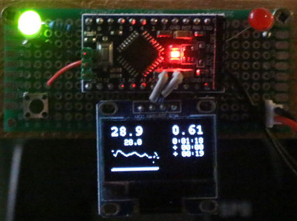
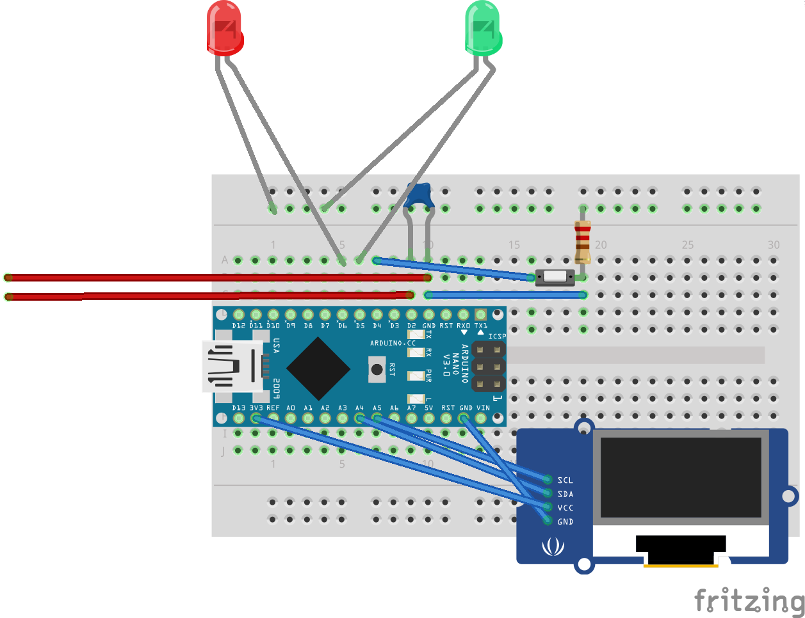

# ergometrino
Simple Arduino-based ergometer display with differential feedback

# Problem statement
Cardio-workout is boring, particularly when practicing indoors. Several existing projects try to alleviate this by doing cool stuff such as
coupling the ergometer to a game console, or even simulating a real bicycle ride in VR. Cool as these are, technically, they don't really help much:
Workout is still boring. So, instead, I'd like to be able to just read a book or watch TV while training. But then it's difficult to keep up a
steady pace.

The idea, here, is to focus on the latter problem, and provide straight-forward feedback, on whether your current level of training is good enough,
or you should try to speed up. However, the "good enough" level will vary not only per person, but also over time (long, term, as you get better,
but also within a training session, as for instance, it's near impossible to go at full speed before you've warmed up). Therefore, the idea is simply
to record a) the previous run and b) the best run (aka highscore), and then provide feedback on how you are currently faring compared to those runs.

# Hardware
The hardware requirements are deliberately minimal.

For a quick overview, refer to the breadboard view shown below (the red wires symbolize the connection to the ergomenter), but read on for details.
. More [hands-on instructions are also available](https://www.instructables.com/id/Simple-Arduino-based-Ergometer-Display-With-Differ/).

## Microprocessor
As the basis, you'll need at least an ATMEGA328 based arduino (or something better), but it does not matter whether it's a Uno, Nano, whatever. Personally
I picked an Arduino Pro Mini at 3.3V 8MHz. Pretty much anything supported by the arduino enviroment should work, however (including STM), as long as your
display has a driver.

## Ergometer connection
Your ergometer will probably have some sort of reed switch or Hall switch sensor for sensing revolutions of the fly wheel or the pedals. Chances are you
can plug right into that. Connect between Gnd and Pin D2 (by default) of your Arduino. If you cannot find an existing interface, just attach a magnet to the pedals, and a
reed switch at a point where the magnet will pass.

_Note_ that in the case of a mechanical switch, you _may_ run into issues with jumping readings due to contact bouncing. While the sketch uses a simple timeout for software
debouncing, it may be helpful to place a 100nF (or so) capacitor between D2 and Gnd for simple hardware debouncing. (No separate resitor needed, capacitor will charge via the
internal pullup resistor.)

The top of the sketch has some defines that you can tweak to convert this into a credible km/h or mph reading, importantly "CM_PER_CLICK".

## Display
This sketch assumes an SSD1306 based 128*64 monochrome display. These are one of the cheapest and easiest display options available, today. Just connect to VCC and Gnd,
SCL, and SCA (Arduino: A4, and A5), and voilá, you're done. However, any other display with similar dimensions and an Adafruit_GFX-compatible driver will work just as
well. You may have to tweak some details, if your display geometry is smaller, but that should not be much of a problem.

## Optional quick reference LEDs
_Optionally_, you can connect LEDs (with appropriate resistors) to D6 and D5, for indication of "you're doing well, you're near or above your best level", and "you're doing
poorly, you're significantly below your best level", respectively. Note: These LEDs indicate the relation between your current speed, and the best recorded speed
_in the current phase of the training_, by default, i.e. the reference speed is _changing_ according to your recorded best training. The idea behind these LEDs is to provide
a rough feedback mechanism that will be noticeable in peripheral vision, i.e. even while you're looking at something else.

A push button connected to Pin D4 can be used to switch the reference used for the above two LEDs between "best level on this segment" (default), "previous level on this segment"
"current speed". The latter is very useful for your initial run, or whenever neither the "best level", nor the "previous level" provide a good reference to your current
training. Modes other than "best level" are indicated by either a small letter "P" or "C" in the lower left corner of the speed graph.

_Note_: In contrast to the "best run" and "previous run" settings, the "current" speed reference will not update, automatically. To update it, manually, press the button thrice
to switch away from, and back to "current speed" setting, while maintaining the desired speed.

## Optional jumpers
Connect the following pins to Gnd to achieve specific non-standard behavior:
- D9: Reset/erase best run recording
- D8: Do not update previous run recording
- D7: Do not update best run recording

## Power supply and consumption
When using a 3.3V Arduino, you can connect a LiPo battery (or three NiMH cells) directly to Vcc and Gnd (this is ok because the ATMEGA will tolerate up to 5.5V; _not_ ok for use
with genuinely 3.3V processors such as STM32!). For this use case, there will also be a "low battery" warning at around 3.4V, without any additional hardware. As the ATMEGA can be
expected to work correctly, at least down to 3.0V or so, that should leave you enough time to finish your training unit before recharging.

Another good supply option is a USB power bank, with a built-in battery indicator. Of course powering with a 9V battery via Vin, and many other power options will work, too, but
you won't get battery level indication, then.

With an SSD1306 display and an Arduino Pro Mini 3.3V, the circuit consumes on the order of 12mA @3.6V _without_ the external LEDs. For an Arduino Nano / Uno, expect consumption to
be 10mA to 20mA higher. Of course external LEDs may also draw substantial current when lit, depending on type of LED and resistor value.

## Storage
To keep things simple, all data is stored in the internal EEPROM. No need to connect any external storage. (However, for this reason, there is also no room to store much
more elaborate data).

The EEPROM is initialized on first usage. After that, at most four bytes of data are updated every time a segment (500m, by default) is completed. Thus, write cycle limitation should not be a concern.

# Feature details

## Numeric displays
- Left hand: Current speed (large) - Average speed - Graph of the speed over the past minute
- Right hand: Distance (large) - Time - Time difference to previous run - Time difference to best run - Low battery warning

## Speed graph
To help maintain a stable speed, the lower left graph plots your speed over the past minute (roughly). This is centered at the current speed, with a range of +/- 7 units.
Dotted lines indicate the average speed _during the current segement_ of the previous, and best runs.

## Quick status LEDs
See above.

## Future extensions
With a bit of tweaking, the display could hold more values such as heart rate, cadence, etc. Also, we could easily keep track of total training time and distance.
Finally, if adding separate SD card storage, you could get a much better resolution of the recorded trainings, and also store separate training profiles (e.g. for
several persons in the same household).

I'll be happy to accept contributions, but I'm unlikely to implement any of that, myself (unless paid to).

# Status
Intial version basically functional.

# License
[GPL Version 3 or later](https://www.gnu.org/licenses/gpl-3.0.en.html).

# Begging
As usual, developing even "simple" things always takes more time than anticipated. Writing up documentation for sharing with others is another significant time sink.
If you like the project, consider donating via PayPal to thomas.friedrichsmeier@gmx.de . Thanks!
